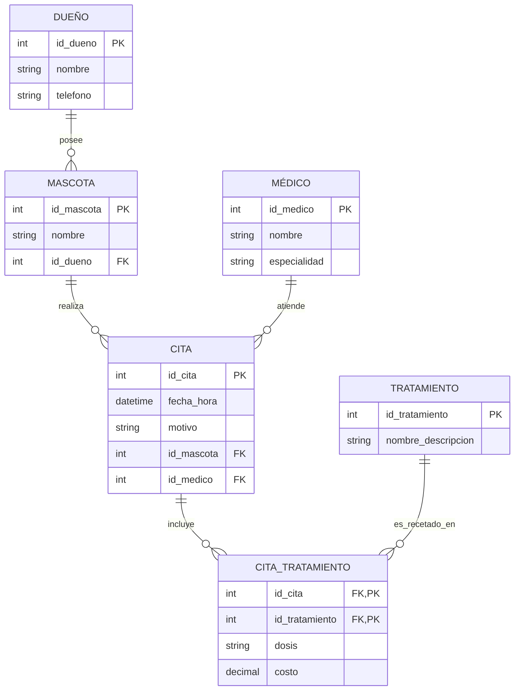

# Prueba Técnica: Sistema para Clínica Veterinaria

Este repositorio contiene la solución a la prueba técnica para la digitalización de la operación de una clínica veterinaria. El proyecto incluye el modelado de la base de datos, la justificación de su normalización, y los scripts SQL para la creación de tablas, inserción de datos de prueba y consultas solicitadas.

---

## Contexto y Requerimientos del Negocio

La clínica necesita dejar atrás los registros en papel para no perder el rastro de los tratamientos de sus pacientes. Las reglas de negocio implementadas son las siguientes:

* **Dueños y Mascotas:** Un dueño puede tener varias mascotas (1:N), pero cada mascota pertenece a un solo dueño.
* **Citas:** Se registra la fecha, hora y motivo de la consulta.
* **Médicos:** La clínica cuenta con varios veterinarios. Cada cita es atendida por un solo médico.
* **Tratamientos:** En una cita se pueden recetar múltiples tratamientos (medicamentos o procedimientos). Es fundamental registrar la dosis y el costo específico de cada tratamiento durante esa consulta.

---

## Modelado (Diseño Entidad-Relación)

A continuación, se presenta el diagrama Entidad-Relación (ERD) que modela la solución. Se utilizó una tabla intermedia (`CITA_TRATAMIENTO`) para resolver la relación de muchos a muchos entre las citas y los tratamientos del catálogo, permitiendo guardar el costo y dosis específicos por evento.

El diseño propuesto cumple con las formas normales de la siguiente manera:

Primera Forma Normal (1NF): Todos los atributos (columnas) son atómicos y no hay grupos repetidos. Por ejemplo, en lugar de guardar múltiples tratamientos separados por comas en la tabla Citas, se creó una tabla detalle separada (Citas_Tratamientos). Cada tabla tiene una llave primaria única.

Segunda Forma Normal (2NF): Cumple con la 1NF. Todos los atributos que no son llave primaria dependen completamente de la llave primaria en su totalidad. Esto es evidente en Citas_Tratamientos, donde los atributos dosis y costo dependen de la combinación completa de la cita y el tratamiento.

Tercera Forma Normal (3NF): Cumple con la 2NF. No existen dependencias transitivas entre los atributos que no son llave. Por ejemplo, el nombre del dueño depende directamente de id_dueno, no del id_mascota, por lo que está correctamente separado en la tabla Dueños.
